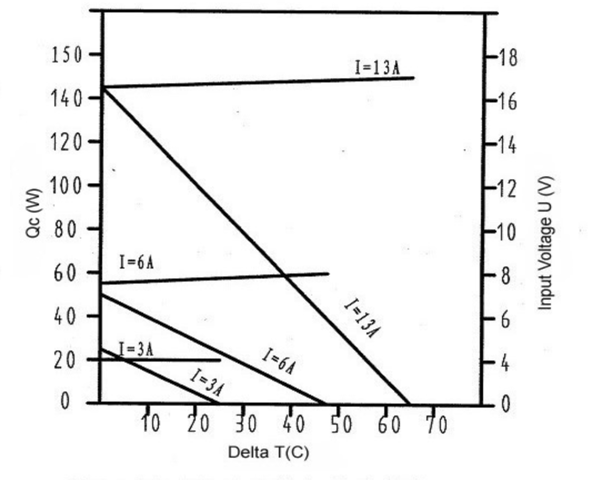

# Water cooling using a Peltier cell - proof of cencept

The aim of this experiment is to detemrine the viability of using a peltier cell to cool water on demand.

In order to do this it was necessary to find the effectiveness of the Peltier cell under realistic conditions. So far no sources were found that would state exactly that, which would be citation-worthy.
Firstly an attempt was made to model the system and this can be seen below. 

# Experimental setup and modelling
The experimental setup can seen above. The water was pumped from one tank to the other with a PC cooling pump. Then it passed through a heat exchanger that was attached to a Peltier cell and a heat sink after which it was dispensed in the second tank. The temperature of the water in the first tank and the temperature of the water at the entry to the second tank was measured. The second tank was placed on a scale to measure the mass flow to the system. Together, these measurements allow to calculate how much heat was taken out of the water. Additionally, the power input to all the devoces was measured. This allows to calculate coefficient of performance of this system. This is the value needed to asses whether Peltier cooling is a viable option.

The experimetal setup is similar to what could be expected in the kiosk but scaled down. Instead of 5 degree drop only 1 degree was expected, but with similar mass flow to the kiosk. This would result in similar water-Peltier heat transfer properties which are important for Peltier cell performance.

# Performance predictions

There are several parts of the system that can be modelled. Unfortunately, most of them lack clear specifications and thorough data to base the predictions on. The basic model would aim to, based on the heat transfer properties and current in the cell (using the characteristics in figure above), determine the temperature difference over the Peltier cell and hence its effectiveness. This analysis is possible to do, but difficult without knowing the exact properties of the cold and hot sinks. 

Hence, we aimed to design teh experiment as an upper bound. The water heat exchanger was purchased as suitable for use in a high end desktop, likely above the price range and size possible in the kiosk. A very strong Peltier cell was specified to achieve a temperature drop measurable with our sensors. The final seetup would require a whole array of Peltier cells, but for simplicity we experimented with just one. 

# Results

The experiment conducted encountered several unexpected obstacles. 

Firstly, we did not have access to a power supply strong enough to create as much cooling as we had anticipated.
This meant that the temperature drop was on the order of 0.1 C which is the same as the experimental error.
This means that although this value is of the order of magnitude as predicted prior to the experiment,
it is of no use in making predictions.

To get some more meaningful results, we had the idea to turn the setup into a continuous circuit where the same mass of water was pumped in a loop, continuously cooling down and allowing us to get better temperature measurements. The setup is shown above. With 150g of water in the circuit, we should have been expecting roughly 0.1 K / second in temperature drop, however we saw close to 0.1 K / minute in reality.

Despite the challenges, several conclusions can nonetheless be drawn:

- Peltier cells require a lot of current and that is more than conventional power systems usually work with. This suggests that the electrical side of the setup will be harder to build and more costly
- Peltier cells require a large amount of cooling. It was noted that even at this low power, the cell heated up considerably which reduced the cooling efficiency. For such a setup to work a large fan and cooling system would be needed.
- At the flow rates expected in the kiosk the rate of heat transfer was not high enough. This may be partially due to the low power available, but could be at least partially due to not enough heat transfer in the water cooled plate.

Together the problems outlined above point to one conclusion. The viability of Peltier cooling on demand in the conditions experienced by the kiosk is very limited. The high power demand and low heat transfer rates suggest that other options should be investigated for cooling.

